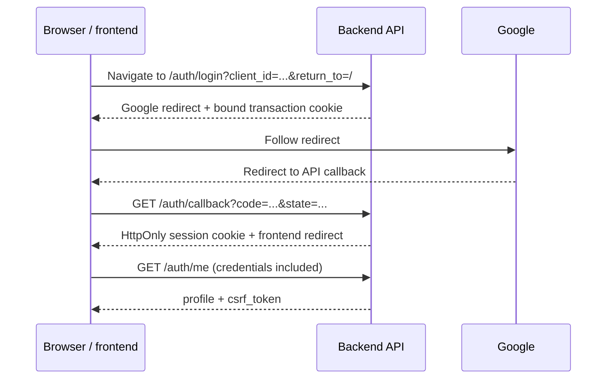

# API migration: backend `main` to the current API

Compare the API changes below, then follow the [migration checklist](#migration-checklist)
to update the frontend and prepare the release. Each comparison explains the
client impact, the reason for the redesign, and the required action.

## Release at a glance

> **Breaking release:** deploy this backend with a compatible frontend. The
> legacy browser client sends Bearer tokens and numeric money; protected browser
> operations now use cookie sessions and CSRF protection, and exact decimals are
> strings. Shared catalogue, fixture, and standings reads are public.

| Comparison | Revision |
| --- | --- |
| Backend `main` comparison source | `3c82b1d` |
| Current documentation source | `cf4532a` on `feat/multi-application-auth` |

This guide describes the current source contract, including registered
applications, scoped backend delegation, public reads, exact-decimal strings,
admin-managed sport types, and match locations. The revision identifies the
source used for this documentation update; it is not a claim about deployed
services. The earlier development baseline is no longer the full target.

All routes below are relative to the unchanged API base path, `/api/v1`.

| Change | Affected client work |
| --- | --- |
| [Browser authentication](#browser-authentication-and-request-protection) | Login, shared transport, session state, logout |
| [Backend delegation](#registered-applications-and-backend-delegation) | Client registry, callbacks, scopes, token rotation and revocation |
| [Public shared reads](#public-shared-reads) | Public screens, signed-out catalogue and fixture requests |
| [Locations and match venues](#location-catalogue-and-match-venues) | Venue CRUD, match forms, match and bill response types |
| [Money](#money-representation) | API types, forms, balance and payout displays |
| [Odds and multipliers](#odds-and-payout-multipliers) | Match/bill/Stake Mines types, formatting, payout previews |
| [Bills](#bill-creation-and-cancellation) | Placement requests, bill responses, admin cancellation |
| [Match results](#match-results) | Admin winner/draw actions and conflict handling |
| [Daily rewards](#daily-reward-administration) | Admin schedule and override controls |
| [Self profile](#self-profile-updates) | Profile forms and editable fields |
| [Errors](#errors-and-request-validation) | API wrappers, validation, failure messages |
| [Access policy administration](#access-policy-administration) | Admin allowlist and blacklist controls |
| [Sport types](#sport-type-administration) | Admin create/rename/delete controls, shared sport selectors and labels |
| [Service health](#added-operational-endpoints) | Liveness and dependency-readiness probes |

For endpoint replacements, use the [route lookup](#route-lookup). For deployment
preparation and acceptance checks, use the [migration checklist](#migration-checklist).

## API comparisons

### Browser authentication and request protection

| Before: `main` | After: current API |
| --- | --- |
| OAuth redirects could expose access/refresh tokens in the URL. | The callback sets an opaque HttpOnly session cookie. |
| Frontend callback exchange and token storage in `localStorage`. | API callback and redirect to the configured frontend. |
| `Authorization: Bearer` on browser requests. | Cookie credentials; `X-CSRF-Token` on POST/PUT/PATCH/DELETE. |
| `POST /auth/refresh` renews browser credentials. | Server-managed session lifetime; no browser refresh route. |
| `GET /auth/me` returns the profile. | The same route returns `profile` and `csrf_token`. |

**Impact:** the existing login callback, token storage, refresh logic, and shared
API transport must change together. A browser Bearer token cannot authenticate
the new browser routes.

**Why it changed:** keeping session credentials out of frontend JavaScript and
redirect URLs reduces credential exposure. Server-side sessions support
revocation; browser-bound OAuth state and PKCE protect login. Exact-Origin and
session-bound CSRF checks protect requests made with automatically sent cookies.

**Required action:** enable `credentials: "include"` in Fetch or
`withCredentials: true` in Axios. Remove browser JWT storage, Bearer headers,
the `POST /auth/login/callback` exchange, and refresh-token handling.

The new login flow is:



Login and callback responses are browser redirects. Register each frontend in
`AUTH_CONFIG_FILE`; `/auth/login` requires its `client_id` and accepts an optional
safe relative `return_to`. New accounts go to the registered `onboarding_path`,
carrying the original destination as `return_to`. Caller-selected `redirect_to`
is unsupported. See [Application authentication](authentication-applications.md)
for backend delegation and credential requirements.

Keep `csrf_token` in memory and send it as `X-CSRF-Token` on protected
POST/PUT/PATCH/DELETE requests. Reload `/auth/me` after a page refresh.

| Session behavior | Client action |
| --- | --- |
| `401`: session missing or invalid | Clear profile/CSRF state and offer login. |
| `503`: session or policy dependency unavailable | Retain frontend state and allow retry. |
| `POST /auth/logout` returns `204` | Discard profile/CSRF state; logout is complete. |
| Logout returns `503` | Revocation is unconfirmed; retain state and allow retry. |

Logout requires credentials, an allowed Origin, and CSRF for an active session.
An absent or expired session also returns `204`. Local HTTP development uses
the HttpOnly `session` cookie; production uses `__Host-session` with HTTPS,
`Secure`, `HttpOnly`, `Path=/`, and no `Domain` attribute. Both use `SameSite=Lax`.
Configure the exact frontend origin in backend CORS/origin settings; the browser
supplies the `Origin` header.

### Registered applications and backend delegation

| Previous integration | Current API |
| --- | --- |
| Caller-selected `redirect_to` or one global post-login URL. | Operator-managed `AUTH_CONFIG_FILE` registry; cookie `return_to` is a validated relative path. |
| `GET /auth/login` fetched as JSON containing a Google URL. | Navigate to `/auth/login?client_id=...&return_to=...`; success is a `303` redirect. |
| Tokens passed to the game frontend callback and stored in JavaScript. | `/auth/authorize` returns a one-use code to the registered game **backend** callback. |
| Unscoped external credentials and administrator issuance/revocation. | Client-authenticated `/auth/token` and `/auth/revoke`; credentials bind account, client, delegation, and scopes. |

**Required action:** register each application in YAML. Cookie applications
configure `frontend_origin`, `default_return_path`, `onboarding_path`, and
`login_error_path`. Confidential backends configure exact `redirect_uris`,
`allowed_scopes`, and `client_secret_env`. Secrets stay in the backend
environment and must match on both backends; no client secret goes to a browser.

The game backend generates and stores browser-bound state and an S256 PKCE
verifier. Browser navigation to `/auth/authorize` includes `response_type=code`,
`client_id`, `redirect_uri`, `state`, `scope`, `code_challenge`, and
`code_challenge_method=S256`. 888 reuses its admitted session or signs in with
Google. Google always returns to 888's `google.callback_uri`. The game backend
then receives `code` and its original `state`, checks its local transaction,
and exchanges the code using form-encoded `/auth/token` with HTTP Basic client
authentication, `grant_type=authorization_code`, `code`, `redirect_uri`, and
`code_verifier`. Credentials stay server-side; the game issues its own cookie.

`grant_type=refresh_token` rotates the refresh credential. Persist the
replacement pair atomically and serialize refreshes for a delegation: reuse
revokes the grant. Backend logout posts `token` to `/auth/revoke` with client
authentication; success is `200` plain-text `OK`, including unknown or
other-client credentials. The 888 browser session and game delegation have
independent lifecycles.

| Delegated resource | Scope and payload |
| --- | --- |
| `GET /external/me` | `profile.read`; returns `{ "profile": { ... } }`, without `csrf_token` |
| `POST /external/deduct-coin` | `coins.spend`; JSON `{ "amount": "25.00" }`; returns `success`, `deducted_amount`, `remaining_balance` |

`allowed_scopes` is the client's maximum permitted set. Authorization requests
choose a nonempty subset, without duplicates. Each resource checks its required
scope against the current registry, active grant, and token. Missing scope
returns `403 FORBIDDEN`; expired/revoked credentials return `401 UNAUTHORIZED`.
The external account comes from authentication, never a caller-supplied user ID.
Deduction is atomic in 888; cross-database consistency and safe retries remain
separate game integration work.

For local development, 888 FE is port `3000`, 888 API and Google callback use
`8080`, Games FE uses `3001`, and the registered Games backend callback uses
`8081`. The browser-facing 888 URL and container-to-888 URL can differ; keep the
same browser hostname across login and callback so host-only cookies are sent.

See [Application authentication](authentication-applications.md) for the full
registry, lifetimes, return-path rules, wire examples, and protocol errors.

### Public shared reads

| Before: `main` | After: public-read update |
| --- | --- |
| Shared catalogue, fixture, and standings reads required a browser session. | The reads below work without a session; the single-sport read is also available. |

| Shared data | Public routes |
| --- | --- |
| Location catalogue | `GET /locations`, `GET /locations/{id}` |
| Fixtures and server time | `GET /matches`, `GET /matches/{id}`, `GET /matches/current/time` |
| Sport catalogue | `GET /sport-types`, `GET /sport-types/{id}` |
| Color standings | `GET /colors/leaderboards`, `GET /colors/group-stage` |

**Impact:** public pages can load venues, sports, fixtures, and standings before
the user signs in. These reads do not require a cookie, Bearer token, or a
completed `/auth/me` request.

**Why it changed:** these routes return shared competition data rather than
account-specific information. Removing the session requirement also means
allowlist and blacklist account checks are not run for these requests.

**Required action:** do not gate these data requests on login state. Keep
administrator mutations protected by the browser session, admin permission,
allowed Origin, and CSRF token. Public access applies only to the listed reads;
account, bill, game/history, and admin reads retain their documented access
requirements. The global IP rate limit still applies at 200 requests per minute.
For browser requests, a supplied `Origin` must exactly match a configured origin;
safe GET requests without an `Origin` are accepted. CORS continues to grant only
configured origins.

### Location catalogue and match venues

| Before: `main` | After: location feature |
| --- | --- |
| Venue names are fixed in the frontend, and match records have no location resource. | Locations are stored in a catalogue; each match references one by stable ID and returns its current `{ id, title }` resource. |

**Impact:** replace fixed venue options with catalogue data, add administrator
controls for location CRUD, and include a location selection in match creation.
Match lists/details and matches nested in bill lines now carry a `location`
object, so clients should display its current title and keep its ID as the value.

**Why it changed:** storing venues as reference data gives match records a
validated, reusable location and lets administrators rename a venue without
editing every match. A foreign key prevents matches from referencing undefined
locations and prevents deleting a venue still in use.

**Required action:** use these routes under `/api/v1`:

| Operation | Access | Result |
| --- | --- | --- |
| `GET /locations` | Public | `200` location array |
| `GET /locations/{id}` | Public | `200` location; `404` if missing |
| `POST /locations/admin` | Admin | `201` created location |
| `PATCH /locations/admin/{id}` | Admin | `200` renamed location |
| `DELETE /locations/admin/{id}` | Admin | `204` when unused; `409 LOCATION_IN_USE` when referenced |

Create a location with an immutable ID and display title:

```json
{ "id": "COURT_A", "title": "Court A" }
```

Rename it with `PATCH /locations/admin/COURT_A` and a body containing only
`{ "title": "North Court" }`. IDs accept 1–100 ASCII letters, digits,
underscores, or hyphens. Titles are trimmed and must contain 1–100 Unicode
characters; duplicate titles are allowed. A duplicate ID returns `409 CONFLICT`.
An invalid ID or title returns `400 INVALID_REQUEST`; a missing location returns
`404 RESOURCE_NOT_FOUND`.

Match creation now requires `location_id`, copied from `GET /locations`; match
updates may supply `location_id` to move a fixture and leave it out to keep the
current venue. The ID must reference an existing location, or the match request
returns `400 INVALID_REQUEST` with a `location_id` detail. Match responses use
`location: { "id": "COURT_A", "title": "Court A" }`, including in nested bill
lines. Renaming a location keeps its ID and updates the title returned for its
existing matches. A referenced location cannot be deleted; reassign or delete
those matches first.

The Goose migration `00004_match_locations.sql` creates `locations` and adds a
required `matches.location_id` foreign key (`ON DELETE RESTRICT`). Run `make seed`
after migrations to insert the default location catalogue; reseeding adds
missing entries without overwriting edited titles.

### Money representation

| Before: `main` | After: current API |
| --- | --- |
| `"remaining_coin": 888.88` | `"remaining_coin": "888.88"` |
| Money DTOs use floating-point values. | Money uses exact integer minor units internally. |
| API money types are JavaScript numbers. | API money types are decimal strings. |

**Impact:** change money types across account balances, bill stakes and payouts,
daily rewards, slot and steal-token results, and Stake Mines wagers, payouts, and
money statistics. Forms must submit strings, and UI
calculations must preserve exact values.

**Why it changed:** floating-point calculations in Go and JavaScript can lose
decimal precision even when the database stores exact decimals. Decimal strings
preserve the fixed-point API contract and avoid JavaScript integer-range limits.
See [the money decision](adr/0001-exact-money-representation.md).

**Required action:** keep API/form money as strings. Use `bigint` minor units
when exact client arithmetic is needed. Convert to a JavaScript number only for
non-authoritative display or visualization; never submit money calculated that way.

Responses always use two decimal places. String inputs such as `"12"`, `"12.3"`,
and `"12.30"` are accepted and normalized. Numeric JSON tokens, exponents, and
more than two fractional digits are rejected. Ordinary `Money` is nonnegative;
derived `SignedMoney` values, such as Stake Mines `net_profit`, can be negative.
[Rates and game multipliers](#odds-and-payout-multipliers) use six-decimal strings.
Scores, counts, indexes, and approximate statistics such as `win_rate` remain numbers.

### Odds and payout multipliers

| Before: `main` | After: exact-decimal implementation |
| --- | --- |
| Bill-line `rate`: `1.75` | `"1.750000"` |
| Match `team_a_rate` / `team_b_rate`: JSON numbers | Six-decimal strings, including matches nested in bills |
| Stake Mines game/history `multiplier`: JSON number | Six-decimal string |

**Impact:** match, bill, and Stake Mines API types and rate-bearing UI state must
change to a distinct `RateString`. Numeric `.toFixed()` calls, floating-point
accumulator multiplication, and zero/truthiness fallbacks need explicit updates.

**Why it changed:** odds and payout multipliers are exact fixed-point values.
Strings preserve all six fractional digits through JSON and JavaScript, including
values whose micro-units exceed JavaScript's safe integer range.

**Required action:** retain rate strings through decoding and state. Parse them
into `bigint` micro-units for calculations and use integer half-up rounding for
display. Accumulator previews multiply exact rates and round once at the final
money amount. Continue submitting only stake and selections when placing bills.
See the [exact-decimal frontend migration](#exact-decimal-frontend-migration)
for affected consumers, exact arithmetic, and acceptance checks.

Rate inputs accept quoted decimals with zero through six fractional digits,
including `"1"` and `"1.75"`; output is always canonical, such as `"1.000000"`
and `"1.750000"`. Numeric JSON tokens, null, negatives, exponents, whitespace
inside values, more than six fractional digits, and overflow are rejected.
Zero is `"0.000000"`. There is no temporary numeric/string dual format.

Stake Mines `win_rate` remains a JSON number representing an approximate
percentage. Scores, counters, and indexes also remain numbers. Stored rates,
odds formulas, rounding, and settlement are unchanged; this Rate change requires
no database migration.

#### Exact-decimal frontend migration

Keep decimal values as strings at API, form, and persisted-state boundaries.
Use distinct branded types so code cannot accidentally treat a rate as money:

```ts
type MoneyString = string & { readonly __money: unique symbol };
type RateString = string & { readonly __rate: unique symbol };
```

| Value | Frontend representation |
| --- | --- |
| Money and signed money | `MoneyString`, exactly two fractional digits in responses |
| Bill-line `rate` | `RateString`, six fractional digits |
| Match `team_a_rate` / `team_b_rate` | `RateString`, including matches nested in bills |
| Stake Mines game/history `multiplier` | `RateString` |
| Scores, counts, indexes, `win_rate` | `number` |

Validate decimal strings at the API boundary. Reject numeric JSON tokens and
never parse through `Number` or `parseFloat`. The backend accepts quoted rates
with zero through six fractional digits, including existing leading-zero
parsing, and returns canonical six-digit strings. Canonical zero and one are
`"0.000000"` and `"1.000000"`. The maximum rate is
`"9223372036854.775807"`, or `9223372036854775807` micro-units.

The current frontend consumers identified for this migration are:

| Consumer | Required change |
| --- | --- |
| `src/api/slip/slip.dto.ts` | Use `RateString` for bill and nested-match rates; remove the legacy create-line rate. |
| `src/components/match/MatchInterface.tsx` | Keep API rates and `RoundItem.rateA`/`rateB` as strings; scores remain numeric. |
| `src/components/match/MatchUtils.tsx` | Stop converting rates with `Number`; keep score conversions separate. |
| `src/components/match/MatchRound.tsx`, `MatchBar.tsx` | Format odds explicitly; retain numeric score props. |
| `src/store/slip.ts` | Store rate strings, replace floating-point multiplication, and clear persisted numeric-rate slips. |
| Slip elements/results and `src/app/slip/page.tsx` | Replace rate `.toFixed()` and numeric payout previews with shared exact helpers. |
| `src/api/event/stakemine.ts` | Use `RateString` for game multipliers and matching history values. |
| `src/components/stakemine/MineTable.tsx` | Keep multiplier state as a string; counts and indexes remain numeric. |

Recheck these consumers against the frontend source before implementation if it
has changed since this migration guide was prepared. At cutover, bump persisted
slip state and discard old numeric-rate selections; reload server odds for new
selections. The old numeric state is not a supported API format.

Add shared rate helpers beside the money helpers: a boundary validator returning
`RateString`, a parser returning `bigint` micro-units, a formatter, and exact
accumulator-preview functions. For a validated decimal `whole.fraction`, pad
the fraction to six places and calculate:

```text
micro = BigInt(whole) * 1_000_000 + BigInt(padded_fraction)
```

Validate decimal characters and the nonnegative int64 range. Normalize shorter
inputs to six places. Use `BigInt(...)` rather than bigint literals if the
frontend TypeScript target does not support those literals. Keep bigint out of
JSON and persisted state; store canonical strings and derive bigint values when
needed.

For nonnegative rational values, integer half-up rounding is:

```text
rounded = (2 * numerator + denominator) / (2 * denominator)
```

Use bigint operands and require a positive denominator. To display a rate with
`d` fractional digits, round `micro * 10^d / 1_000_000`, then split and pad the
whole and fractional portions. Display rounding must not replace the original
API value in state.

For accumulator payout previews, parse the stake as bigint minor units and
calculate the full product before rounding:

```text
numerator     = stake_minor * product(rate_micro[i])
denominator   = 1_000_000 ^ number_of_rates
payout_minor  = half_up(numerator / denominator)
```

Round once at the final money amount; do not round intermediate multipliers or
each leg's payout. An empty rate list has product and denominator one. A draw
uses the settlement-neutral rate `"1.000000"`. Format combined odds directly
from the unrounded product ratio. If the final result exceeds the backend's
nonnegative int64 minor-unit range, show a failed preview instead of an
approximate amount. Previews are informational: `POST /bills` submits only the
stake `total` and line `match_id`/`betting_on`; server rates and payouts are
authoritative.

Because `"0.000000"` is truthy, replace `rate || 2` and loose numeric checks
with explicit null/undefined checks and an exact zero check on micro-units.
Preserve existing fallback behavior: use `"2.000000"` where zero or missing odds
previously selected numeric `2`, use `"0.000000"` where a missing rate
previously became zero, and use `"1.000000"` for a missing Mines multiplier.
A supplied zero Mines multiplier must remain zero. Backend rate fields are
non-null; null handling only covers frontend state or missing responses.

Frontend acceptance checks:

- Run `pnpm exec tsc --noEmit --incremental false` in the frontend.
- Verify `"0.000000"`, `"1.750000"`, and `"1.234567"` in match, bill, and Mines
  screens; API and store values remain strings and rate formatting does not use
  `.toFixed()`.
- With two display digits, `"1.234999"` renders `1.23`, `"1.235000"` renders
  `1.24`, and `"1.999999"` renders `2.00`.
- A `"0.01"` stake with two `"1.500000"` rates previews `"0.02"`; rounding each
  leg first would incorrectly produce `"0.03"`. A `"1.00"` stake with
  `"1.005000"` previews `"1.01"`.
- Verify `"9007199254.740993"` parses exactly to `9007199254740993` micro-units,
  beyond JavaScript's safe integer range.
- Check explicit zero/null fallbacks, removal of old persisted numeric slips,
  rejection of nonnumeric input, and a handled payout-overflow preview.
- Confirm bill requests contain only stake and selections and that server
  responses remain authoritative. Money stays two-decimal strings; `win_rate`,
  scores, counts, and indexes stay numbers.

### Bill creation and cancellation

| Before: `main` | After: current API |
| --- | --- |
| Bill lines include a client-provided `rate`. | Lines contain only `match_id` and `betting_on`. |
| Creation returns a success message. | Creation returns the bill and its lifecycle fields. |
| Client `PATCH`/`DELETE` bill routes. | Immutable placement; admin void operation for pending bills. |

**Impact:** update placement payloads and response types. Replace cancellation
controls with an administrator workflow that collects a reason.

**Why it changed:** the backend calculates and snapshots rates, checks the
balance, and deducts the stake atomically. This removes client-controlled pricing.
Voiding records the actor/reason and refunds a pending bill atomically, preserving
its history. Repeating a void does not issue another refund.

**Required action:** change the `POST /bills` body as follows. IDs in examples
are placeholders for existing resources.

Before — legacy payload:

```json
{
  "total": 100,
  "lines": [{ "match_id": "match-id", "betting_on": "team-id", "rate": 2.0 }]
}
```

After — new payload:

```json
{
  "total": "100.00",
  "lines": [{ "match_id": "match-id", "betting_on": "team-id" }]
}
```

Read server-provided rates and bill fields: `status`, `payout`, `settled_at`, and
`voided_at`. Use the returned bill for authoritative payouts. The submitted
`total` is the stake used by the backend to calculate the payout.

For an approved cancellation, an admin sends `PUT /bills/admin/{id}/void`:

```json
{ "reason": "Approved cancellation" }
```

Remove calls to `PATCH /bills/{id}` and `DELETE /bills/{id}`. A settled bill
cannot be voided; surface `409 BILL_CONFLICT` to the operator.
The authenticated `GET /bills` and `GET /bills/{id}` remain scoped to the
current user's bills. Administrators can now review all bills with
`GET /bills/admin/all`.

### Match results

| Before: `main` | After: current API |
| --- | --- |
| `PATCH /matches/{id}/winner/{winner_id}` | `PUT /matches/{id}/result` with a winner body |
| `PATCH /matches/{id}/draw` | `PUT /matches/{id}/result` with a draw body |

**Impact:** both admin result actions call one endpoint. Setting a result can
settle bills; an incompatible terminal result returns `409 MATCH_RESULT_CONFLICT`.

**Why it changed:** one terminal-result operation records the outcome and
settles eligible bills in the same transaction. Repeating an identical result
succeeds without another payment; a conflicting result is rejected.

**Required action:** send one of these bodies to `PUT /matches/{id}/result`.

Winner:

```json
{ "outcome": "winner", "winner_id": "team-id" }
```

Draw:

```json
{ "outcome": "draw" }
```

Handle conflicts explicitly. Score editing continues to use
`PATCH /matches/{id}/score`.

### Daily reward administration

| Before: `main` | After: current API |
| --- | --- |
| `POST /events/daily-rewards` with date and numeric amount. | `PUT /events/daily-rewards/{date}` with a string amount. |
| No schedule read/delete API. | Schedule GET and per-date DELETE. |

**Impact:** admin screens load the schedule and manage individual overrides.
Dates use `DD-MM-YYYY`; removing an override restores the configured default.

**Why it changed:** an explicit schedule makes the default and overrides
visible. Per-date PUT expresses create-or-replace behavior safely on retries;
DELETE restores the default without inventing a replacement amount. Daily claims
are persisted by user and reward date, so the uniqueness check survives process
restarts.

**Required action:** load `GET /events/daily-rewards`, which returns
`default_amount` and `overrides`. For example, set an override with
`PUT /events/daily-rewards/29-09-2026`:

```json
{ "amount": "0.00" }
```

Delete it with `DELETE /events/daily-rewards/29-09-2026`. All schedule routes
require admin access. The user claim route remains `GET /events/redeem/daily`;
mark the claim complete only after success, or show already claimed for
`409 DAILY_REWARD_ALREADY_CLAIMED`. Goose migration
`00002_daily_reward_claims.sql` creates the persistent claim ledger.

### Self-profile updates

| Before: `main` | After: current API |
| --- | --- |
| `PATCH /users/{id}` with a broad user DTO. | `PATCH /users/me` with only editable profile fields. |
| Client supplies the target user ID. | Account ID comes from the authenticated session. |

**Impact:** profile forms submit only `name`, `nick_name`, and `group_id`.
Identity, email, role, and balance fields are rejected.

**Why it changed:** selecting the account from authentication and limiting
editable fields makes the self-service boundary explicit. Profile edits cannot
be used to write account privileges or credit balances.

**Required action:** use `PATCH /users/me` with only the fields to change:

```json
{ "nick_name": "Oak", "group_id": null }
```

Omitted fields are preserved. `null` clears `nick_name` or `group_id`; a supplied
`name` must be nonempty. An empty update is invalid. The deprecated
`PATCH /users/{id}` alias accepts the same body and requires the signed-in user's
ID; another ID returns `403 FORBIDDEN`.

Administrator updates to another account use `PATCH /users/admin/{id}`. Supply
a nonempty `name` and the intended money-string `remaining_coin` on each request;
an omitted balance is decoded as `"0.00"` and written. An omitted `nick_name`
clears it. `group_id` changes when a non-null ID is supplied and is otherwise
preserved. The route does not accept `role_id`; role promotion/demotion remains
an operator database workflow. `GET /users/{id}` remains available.

### Errors and request validation

The resource envelope below applies to browser and delegated resource APIs.
`/auth/token` and `/auth/revoke` use `{ "error": "..." }` for protocol failures;
login/authorization failures redirect or render local HTML. The global limiter
can return `429 TOO_MANY_REQUESTS` with the resource envelope on every API route.
See [authentication responses](authentication-applications.md#responses-and-errors).


| Before: `main` | After: current API |
| --- | --- |
| Endpoint-specific `error` or `message` objects. | Shared `{ code, message, request_id, details? }` envelope. |
| Clients match error text or discard failure details. | Clients branch on stable codes and retain diagnostics. |
| Permissive JSON decoding in many handlers. | Unknown fields and malformed/non-object bodies are rejected. |

**Impact:** API wrappers must preserve status and the failure body. Stale fields
such as bill-line `rate` or self-profile `remaining_coin` cause validation errors.

**Why it changed:** stable codes make client behavior independent of message
wording. Expected business failures use meaningful statuses, and request IDs
connect support reports to server logs. Strict bodies expose incompatible
payloads; unexpected failures return safe messages without internal details.

**Required action:** branch on `code`, display `message`, and retain
`request_id` for support. The same ID is exposed in `X-Request-ID`.

```json
{
  "code": "DAILY_REWARD_ALREADY_CLAIMED",
  "message": "Daily reward already claimed",
  "request_id": "c48c6fe7-c83e-4e1f-a4d8-78370f2a94fd"
}
```

| Status / example code | Client handling |
| --- | --- |
| `400 INVALID_REQUEST` | Correct the payload; show safe field `details` when present. |
| `401 UNAUTHORIZED` | Clear session state and offer login. |
| `403 FORBIDDEN` | Surface the Origin, CSRF, or permission failure. |
| `404 RESOURCE_NOT_FOUND` | Show that the requested resource is unavailable. |
| `409` / domain conflict code | Show the rejected action or already-completed state. |
| `422 INSUFFICIENT_BALANCE` | Show insufficient funds; preserve the failed action. |
| `429 TOO_MANY_REQUESTS` | Ask the user to wait before retrying. |
| `503 DEPENDENCY_UNAVAILABLE` | Preserve frontend state and allow retry. |
| `500 INTERNAL_ERROR` | Show the safe message and retain the request ID. |

### Access policy administration

| Before: `main` | After: current API |
| --- | --- |
| Access lists maintained in source. | Admin-managed allowlist/blacklist policies. |

**Impact:** admin access-management screens use `/auth/policies` to list,
create, update, and disable allowlist/blacklist entries.

**Why it changed:** stored policies can be audited, disabled, or expired without
a deployment. Shared policy checks apply during login and to existing browser
sessions, so access changes take effect across the browser API.

**Required action:** admins use GET/POST `/auth/policies` and PATCH/DELETE
`/auth/policies/{id}` with the browser session and mutation protections. Use
[the policy reference](README.md#access-policy-administration) for resource fields.

### Sport type administration

| Before: `main` | After: sport-type CRUD addition |
| --- | --- |
| Authenticated `GET /sport-types` catalogue only. | Catalogue read remains; `GET /sport-types/{id}` reads one entry. |
| Sport catalogue maintained through seed data. | Admin create, rename, and delete routes under `/sport-types/admin`. |
| Deleting a sport can cascade into matches and tournament groups. | Restrictive foreign keys preserve all referenced records. |

**Impact:** add management controls to the admin sports page. Load selectors and
labels from the catalogue so newly created sports and renamed titles appear
throughout the frontend. Titles can be duplicated; use IDs as keys and values.

**Why it changed:** administrators can manage the catalogue without a deployment.
Restrictive database constraints prevent deletion from removing fixtures or
tournament data, including when a new reference races with DELETE.

**Required action:** load the catalogue through its public GET routes without
gating the request on sign-in. Admins create with `POST /sport-types/admin`:

```json
{ "id": "BADMINTON_ALL", "title": "Badminton" }
```

Rename with `PATCH /sport-types/admin/BADMINTON_ALL` and only a `title` field.
Delete an unused entry with `DELETE /sport-types/admin/BADMINTON_ALL`. Mutations
require the browser session, allowed Origin, and CSRF token. IDs are immutable
1–100-character ASCII identifiers using letters, digits, underscores, or hyphens.
Titles are trimmed and must contain 1–100 characters; duplicate titles are allowed.
Unknown fields are rejected. Existing IDs return `409 CONFLICT`; missing entries
return `404 RESOURCE_NOT_FOUND`.

Display `409 SPORT_TYPE_IN_USE` clearly and retain the entry: a match, tournament
group, or stage record still references it. DELETE otherwise returns an empty
`204`. The fresh schema now defines restrictive foreign keys. Recreate local
databases built from the earlier baseline before enabling deletion; editing an
applied baseline does not alter their constraints. Seeding
preserves renamed titles but explicitly rerunning it can restore deleted default
entries. See the [sport-type frontend migration](#sport-type-frontend-migration)
for consumers, catalogue behavior, error handling, and acceptance checks.

#### Sport-type frontend migration

The frontend currently has fixed sport options and reverse maps from titles to
IDs. Replace them with the shared catalogue. The consumer list below was based
on `intania-888-frontend` revision `105fd51`, inspected on 2026-09-29; recheck
these paths if the frontend source has changed before implementation.

| Consumer | Required change |
| --- | --- |
| `src/api/sportType.ts` | Add single-read, create, rename, and delete functions; preserve the catalogue resource type. |
| `src/app/admin/sports/page.tsx` | Add create, rename, and delete controls; keep IDs visible and remove the obsolete constants reference. |
| `src/components/match/MatchMapAndList.tsx` | Replace fixed titles, options, and title-to-ID maps with API entries; retain unrelated color/league presentation choices. |
| `src/app/page.tsx`, `src/app/match/page.tsx`, `MatchBanner.tsx`, `SlipElement.tsx`, `SlipResult.tsx` | Replace fixed choices/reverse maps and resolve current titles by stable ID. |
| Shared `Selector` | Support distinct option ID/value and display label. |
| Admin match create/edit/list pages | Share refreshed catalogue data and use IDs for selections and React keys. |

Load the catalogue through one shared hook or store with loading, empty, and
error states. Refresh or invalidate it after every successful sport mutation,
and refetch when entering sport-consuming screens so changes from another
browser session appear.

Use `sport.id` for keys, option values, and lookup-map keys; use `sport.title`
only as the label. Duplicate titles are valid, including existing seeded
duplicates, so never reverse-map a title to an ID. Include IDs in the UI when
duplicate labels need to be distinguished. Keep an “all sports” filter as
separate UI state such as `null`; `ALL` is a valid catalogue ID. Give custom
sports a usable default presentation without requiring a hardcoded category or
style entry. Renames change labels without changing selected IDs. When a
selected unused sport is deleted, clear the stale selection after refreshing
the catalogue.

Validate IDs as 1–100 ASCII letters, digits, underscores, or hyphens; validate
trimmed titles as 1–100 Unicode characters (count code points, not UTF-16 code
units). Do not derive IDs from editable titles. Create sends `{ id, title }`,
rename sends only `{ title }`, and unknown fields are rejected. Use the shared
API client, encode IDs as path segments, and preserve the shared error envelope.
Public reads still use the configured-Origin and global IP rate-limit behavior;
mutations need an admin session, allowed Origin, and CSRF token.

Handle common failures as follows:

| Failure | UI handling |
| --- | --- |
| `400 INVALID_REQUEST` | Show field details and preserve input. |
| `409 CONFLICT` on create | Explain that the ID exists and allow another choice. |
| `404 RESOURCE_NOT_FOUND` | Refresh the catalogue and explain that the entry is unavailable. |
| `409 SPORT_TYPE_IN_USE` on delete | Explain that matches, groups, or stages still use it; keep it visible. |
| `401` on a mutation | Restore the browser session before retrying. |
| `403` on a read | Check whether the browser Origin is configured. |
| `403` on a mutation | Check admin permission, Origin, and CSRF state. |
| `429 TOO_MANY_REQUESTS` | Use shared retry/backoff behavior for the per-IP limit. |
| Dependency or unexpected failure | Preserve the error code and request ID; allow retry where appropriate. |

There is no archive control in this release. Reseeding preserves renamed titles,
but explicitly rerunning the seed can restore a deleted default entry; treat
that as seed behavior rather than a client-side deletion failure.

Frontend acceptance checks:

- Run `pnpm exec tsc --noEmit --incremental false` in the frontend.
- As an admin, create a custom sport and verify it appears in management,
  match create/edit selectors, user filters, and labels after refresh.
- Rename it and verify the ID stays unchanged, labels refresh, and existing
  selections still point to that ID.
- Create two sports with the same title and confirm each ID remains selectable.
- Verify empty, invalid, and overlong IDs/titles and duplicate IDs show useful
  validation without losing form input.
- Delete an unused entry; treat `204` as success without decoding JSON. For a
  referenced entry, show `SPORT_TYPE_IN_USE` and preserve the sport and dependents.
- Verify signed-out and regular users can load the catalogue, while only admins
  can mutate it. Confirm writes without a session fail and write Origin/CSRF
  protections remain enforced; a disallowed Origin on a public read is denied.
- Verify catalogue loading, empty, and error states, an ID named `ALL`, duplicate
  labels, and unknown-ID fallbacks.

## Route lookup

### Removed, replaced, or deprecated routes

| Legacy route | Migration target |
| --- | --- |
| `POST /auth/login/callback` (removed) | [API callback login flow](#browser-authentication-and-request-protection) |
| `POST /auth/refresh` (removed) | Server-managed cookie session; delegated backends refresh through `/auth/token` |
| `PATCH /bills/{id}` (removed) | Bills are immutable after placement. |
| `DELETE /bills/{id}` (removed) | Admin `PUT /bills/admin/{id}/void` for pending cancellation |
| `PATCH /matches/{id}/winner/{winner_id}` (replaced) | `PUT /matches/{id}/result` with winner body |
| `PATCH /matches/{id}/draw` (replaced) | `PUT /matches/{id}/result` with draw body |
| `POST /events/daily-rewards` (replaced) | GET schedule, PUT/DELETE per-date override |
| `PATCH /users/{id}` (deprecated alias) | `PATCH /users/me` for self-profile edits |

### Added routes

| Route | Purpose |
| --- | --- |
| `GET /auth/authorize` | Registered backend authorization with client state and S256 PKCE |
| `POST /auth/token` | Code exchange or rotating refresh; backend HTTP Basic client auth |
| `POST /auth/revoke` | Revoke the authenticated client's delegation |
| `GET /external/me` | Delegated profile read with `profile.read` |
| `POST /external/deduct-coin` | Delegated money-string deduction with `coins.spend` |
| `POST /auth/logout` | Browser session revocation |
| `PATCH /users/me` | Self-profile update |
| `PATCH /users/admin/{id}` | Administrator profile and balance update |
| `GET /events/daily-rewards` | Admin schedule read |
| `PUT /events/daily-rewards/{date}` | Admin override create/replace |
| `DELETE /events/daily-rewards/{date}` | Admin override removal |
| `GET /bills/admin/all` | Administrator list of all bills |
| `PUT /bills/admin/{id}/void` | Admin pending-bill refund with audit reason |
| `PUT /matches/{id}/result` | Admin terminal result and settlement |
| `GET /auth/policies`, `POST /auth/policies` | Admin policy list/create |
| `PATCH /auth/policies/{id}`, `DELETE /auth/policies/{id}` | Admin policy update/disable |
| `GET /locations`, `GET /locations/{id}` | Public venue catalogue and single-location reads |
| `POST /locations/admin`, `PATCH /locations/admin/{id}` | Admin location creation and rename |
| `DELETE /locations/admin/{id}` | Admin deletion of an unused location |
| `GET /sport-types/{id}` | Single catalogue entry (public in this update) |
| `POST /sport-types/admin` | Admin sport creation |
| `PATCH /sport-types/admin/{id}` | Admin sport rename |
| `DELETE /sport-types/admin/{id}` | Admin deletion of unused sports |

### Added operational endpoints

These server-level endpoints are outside the `/api/v1` base path:

| Route | Purpose and result |
| --- | --- |
| `GET /healthz` | Liveness probe; returns `200` with `{ "status": "ok" }` while the process responds. |
| `GET /readyz` | Readiness probe; returns `200` with `{ "status": "ready" }` when PostgreSQL and Redis respond, otherwise `503` with `{ "status": "not_ready" }`. |

Use `/readyz` to decide whether the service can receive traffic; `/healthz` and
the existing `/api/v1/` text response do not check PostgreSQL or Redis.

### Public read access

The following shared reads do not require browser authentication and do not run
account allowlist or blacklist checks:

| Routes | Data |
| --- | --- |
| `GET /locations`, `GET /locations/{id}` | Location catalogue and one location |
| `GET /matches`, `GET /matches/{id}`, `GET /matches/current/time` | Fixtures, one fixture, and current server time |
| `GET /sport-types`, `GET /sport-types/{id}` | Sport catalogue and one sport |
| `GET /colors/leaderboards`, `GET /colors/group-stage` | Color standings and group-stage table |

`GET /sport-types` existed in both compared revisions; its access policy changed
from authenticated to public. The single-sport route and the other routes above
are listed here with their current access behavior. Origin checks and the global
200-requests-per-minute IP limit still apply; see
[Public shared reads](#public-shared-reads).

## Migration checklist

### 1. Prepare the release

- [ ] Coordinate the backend and compatible frontend as one cutover; use the
  [impact overview](#release-at-a-glance) to assign client changes.
- [ ] Configure the exact frontend origin in CORS/origin settings, the OAuth
  callback in the auth YAML registry, per-application destinations, matching
  backend client secrets, and Redis session/delegation storage. Check the
  [development/production cookie requirements](#browser-authentication-and-request-protection).
- [ ] Prepare production data using the [database archive-and-reset rollout](adr/0001-exact-money-representation.md#archive-and-reset-rollout):
  restore-test the archive, provision a fresh database, apply Goose migrations,
  and seed required reference data. This release does not convert legacy rows
  in place. Do not use migration `down` or `reset` as an upgrade step.
- [ ] Apply `00004_match_locations.sql`, then run `make seed` to populate the
  default location catalogue. See
  [Locations and match venues](#location-catalogue-and-match-venues).
- [ ] Recreate local databases from the revised fresh schema before enabling
  sport management; confirm restrictive sport references on matches, groups,
  and stages. Existing databases do not pick up edits to an applied baseline.

- [ ] Register backend integrations, deploy their browser-bound callback and
  server-side credential storage, and switch them to the scoped code flow.
  Check container-to-888 networking separately from browser redirects.

### 2. Update the shared client

- [ ] Migrate [authentication and transport](#browser-authentication-and-request-protection):
  cookie credentials, API callback, in-memory CSRF, page-reload initialization,
  and logout. Remove JWT storage, Bearer headers, and refresh handling.
- [ ] Change [money types and form submissions](#money-representation) to strings.
- [ ] Change [odds/multiplier types](#odds-and-payout-multipliers) to `RateString`;
  centralize exact formatting and accumulator previews using the
  [exact-decimal frontend migration](#exact-decimal-frontend-migration). Keep
  scores, counters, indexes, and approximate `win_rate` numeric.
- [ ] Preserve [structured failures](#errors-and-request-validation) in API
  wrappers. Use codes for behavior, messages for display, and request IDs for support.
- [ ] Load the [public shared reads](#public-shared-reads) without waiting for
  `/auth/me`; handle configured-Origin failures and the global IP rate limit.

### 3. Update feature requests and screens

- [ ] [Bills](#bill-creation-and-cancellation): remove submitted rates, consume
  the returned bill, use `/bills/admin/all` for admin review, and replace
  cancellation with the admin void workflow.
- [ ] [Match results](#match-results): use the unified PUT route for winner/draw
  and display settlement conflicts.
- [ ] [Daily rewards](#daily-reward-administration): load the schedule, use
  per-date PUT/DELETE, and advance claim state only after the expected response.
- [ ] [Self profile](#self-profile-updates): use `/users/me` and submit only
  editable fields; use the separate admin route for other accounts.
- [ ] [Access administration](#access-policy-administration): use `/auth/policies`
  for admin allowlist/blacklist controls with session and mutation protections.
- [ ] Add [admin sport controls](#sport-type-administration) and replace fixed
  sport lists and title-to-ID maps with catalogue IDs and current titles. The
  public catalogue can load before sign-in; keep sport mutations admin-only.
- [ ] Replace hard-coded venue choices with `GET /locations`; add admin location
  management and use stable location IDs in match create/edit requests. Read the
  nested `location` resource from match and bill-line responses.

### 4. Cut over and smoke-check

Deploy the prepared backend and matching frontend together. Run the checks with
controlled accounts and resources against the prepared deployment.

| Check | Expected result |
| --- | --- |
| Check `/healthz` and `/readyz`. | Liveness returns `200`; readiness returns `200` only while PostgreSQL and Redis are available. |
| Sign in, then reload the frontend. | `/auth/me` loads profile and CSRF state using the session cookie. |
| Fetch locations, sports, fixtures, server time, and standings while signed out. | The listed public reads succeed without session credentials; account allowlist/blacklist checks are not run. |
| Request a public read with a configured, unconfigured, then absent Origin. | Configured Origin succeeds with CORS; unconfigured Origin returns `403`; safe GET without Origin succeeds. |
| Exceed the API request limit from one client IP. | The request after 200 requests in the one-minute window returns `429 TOO_MANY_REQUESTS`. |
| Perform a protected mutation with valid Origin/CSRF. | Authorized request succeeds. |
| Repeat a protected mutation without CSRF. | `403 FORBIDDEN`; no mutation is accepted. |
| Request a protected route with an expired session. | `401 UNAUTHORIZED`; frontend offers login. |
| Edit the current profile. | Only supplied editable fields change. |
| Update another account through the admin user route. | Intended balance is preserved; role changes remain an operator database workflow. |
| Read match odds and place/read a bill. | Money uses two-decimal strings; rates use six-decimal strings, including nested matches. |
| Read Stake Mines game/history and stats. | Multipliers are six-decimal strings; `win_rate`, counts, and indexes remain numbers. |
| Check displayed odds and accumulator payout previews. | Integer half-up formatting; payout is rounded once at the final money amount. |
| Void a pending bill as admin, then repeat. | One refund; repeating the void preserves the returned bill. |
| List bills as admin and as a regular user. | `/bills/admin/all` lists all bills; `/bills` remains scoped to the signed-in user. |
| Set and delete a daily override as admin. | Schedule reflects the override, then the configured default applies. |
| Create and rename a sport as admin. | Admin page, selectors, and labels show the new/current title under the same ID. |
| Delete an unused sport, then try a referenced sport. | Unused entry returns `204`; referenced entry returns `409 SPORT_TYPE_IN_USE`, preserving dependents. |
| Create and rename a location as admin, then read its assigned match. | The ID stays stable and the match response shows the current location title. |
| Create a match with an unknown location, then delete a location used by a match. | Match creation returns `400 INVALID_REQUEST`; deletion returns `409 LOCATION_IN_USE`. |
| Set a match result, then repeat it. | Identical result succeeds without duplicate settlement. |
| Submit a conflicting result or void a settled bill. | `409` remains visible to the operator. |
| Log out, then request `/auth/me`. | Logout returns `204`; protected profile request returns `401`. |

## Source references

- [Backend API reference and error contract](README.md)
- [OpenAPI specification](openapi.yaml)
- [Exact-decimal frontend migration](#exact-decimal-frontend-migration)
- [Sport-type frontend migration](#sport-type-frontend-migration)
- [Exact money decision](adr/0001-exact-money-representation.md)
- [Application authentication](authentication-applications.md) and [registry](../pkg/config/auth_registry.go)
- [Authentication routes](../internal/domain/auth/adapter.http.go) and [application handlers](../internal/domain/auth/adapter.http.applications.go)
- [Delegated scope middleware](../internal/domain/middleware/adapter.http.external.go)
- [Bill routes](../internal/domain/bill/adapter.http.go) and [request/response DTOs](../internal/domain/bill/adapter.http.dto.go)
- [Match routes](../internal/domain/match/adapter.http.go) and [request/response DTOs](../internal/domain/match/adapter.http.dto.go)
- [Event routes](../internal/domain/event/adapter.http.go) and [request/response DTOs](../internal/domain/event/adapter.http.dto.go)
- [User routes](../internal/domain/user/adapter.http.go) and [request/response DTOs](../internal/domain/user/adapter.http.dto.go)
- [Policy routes](../internal/domain/policy/adapter.http.go)
- [Daily reward claim ledger migration](../migrations/00002_daily_reward_claims.sql) and [access policy migration](../migrations/00003_auth_access_policies.sql)
- [Location routes](../internal/domain/location/adapter.http.go)
- [Location schema migration](../migrations/00004_match_locations.sql) and [default location seeds](../cmd/seed/main.go)
- [Sport-type routes](../internal/domain/sporttype/adapter.http.go) and [fresh-schema deletion constraints](../migrations/00001_fresh_schema.sql)
- [Color standings routes](../internal/domain/color/adapter.http.go)
- [Server health and readiness routes](../cmd/server/server.http.go)
- [Shared error contract](../internal/apierror/error.go) and [strict JSON decoding](../internal/apierror/json.go)

The compared revisions above identify this guide's API contract. Linked source
and reference files may evolve afterward.
