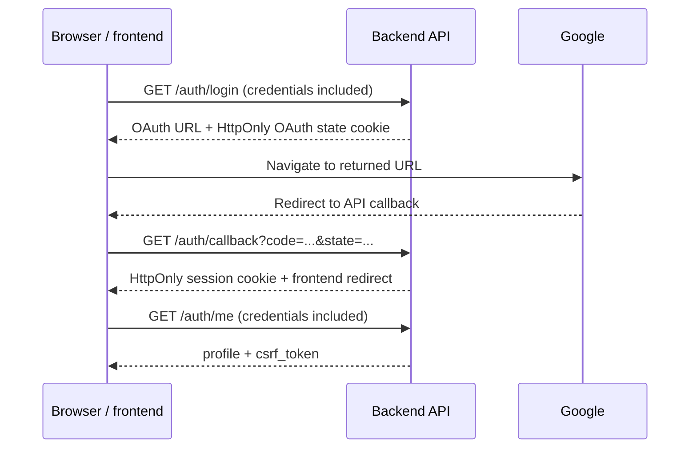

# API migration: backend `main` to `development`

Compare the API changes below, then follow the [migration checklist](#migration-checklist)
to update the frontend and prepare the release. Each comparison explains the
client impact, the reason for the redesign, and the required action.

## Release at a glance

> **Breaking release:** deploy this backend with a compatible frontend. The
> legacy browser client sends Bearer tokens and numeric money; the new browser
> API requires cookie sessions, CSRF protection, and strings for exact decimals.

| Comparison | Revision |
| --- | --- |
| Backend `main` | `3c82b1d` (`origin/main` at comparison time) |
| Backend `development` API implementation | `74495fd` |

This guide compares API behavior at these revisions. The development revision
includes exact-decimal strings and admin-managed sport types with restrictive
foreign keys in the fresh schema.
All routes below are relative to the unchanged API base path, `/api/v1`.

| Change | Affected client work |
| --- | --- |
| [Browser authentication](#browser-authentication-and-request-protection) | Login, shared transport, session state, logout |
| [Money](#money-representation) | API types, forms, balance and payout displays |
| [Odds and multipliers](#odds-and-payout-multipliers) | Match/bill/Stake Mines types, formatting, payout previews |
| [Bills](#bill-creation-and-cancellation) | Placement requests, bill responses, admin cancellation |
| [Match results](#match-results) | Admin winner/draw actions and conflict handling |
| [Daily rewards](#daily-reward-administration) | Admin schedule and override controls |
| [Self profile](#self-profile-updates) | Profile forms and editable fields |
| [Errors](#errors-and-request-validation) | API wrappers, validation, failure messages |
| [Access policy administration](#access-policy-administration) | Admin allowlist and blacklist controls |
| [Sport types](#sport-type-administration) | Admin create/rename/delete controls, shared sport selectors and labels |

For endpoint replacements, use the [route lookup](#route-lookup). For deployment
preparation and acceptance checks, use the [migration checklist](#migration-checklist).

## API comparisons

### Browser authentication and request protection

| Before: `main` | After: `development` |
| --- | --- |
| OAuth redirects could expose access/refresh tokens in the URL. | The callback sets an opaque HttpOnly session cookie. |
| Frontend callback exchange and token storage in `localStorage`. | API callback and redirect to the configured frontend. |
| `Authorization: Bearer` on browser requests. | Cookie credentials; `X-CSRF-Token` on POST/PUT/PATCH/DELETE. |
| `POST /auth/refresh` renews browser credentials. | Server-managed session lifetime; no browser refresh route. |
| `GET /auth/me` returns the profile. | The same route returns `profile` and `csrf_token`. |

**Impact:** the existing login callback, token storage, refresh logic, and shared
API transport must change together. A browser Bearer token cannot authenticate
the new browser routes.

**Why it changed:** keeping session credentials out of frontend JavaScript and
redirect URLs reduces credential exposure. Server-side sessions support
revocation; browser-bound OAuth state and PKCE protect login. Exact-Origin and
session-bound CSRF checks protect requests made with automatically sent cookies.

**Required action:** enable `credentials: "include"` in Fetch or
`withCredentials: true` in Axios. Remove browser JWT storage, Bearer headers,
the `POST /auth/login/callback` exchange, and refresh-token handling.

The new login flow is:



Keep `csrf_token` in memory and send it as `X-CSRF-Token` on protected
POST/PUT/PATCH/DELETE requests. Reload `/auth/me` after a page refresh.

| Session behavior | Client action |
| --- | --- |
| `401`: session missing or invalid | Clear profile/CSRF state and offer login. |
| `503`: session or policy dependency unavailable | Retain frontend state and allow retry. |
| `POST /auth/logout` returns `204` | Discard profile/CSRF state; logout is complete. |
| Logout returns `503` | Revocation is unconfirmed; retain state and allow retry. |

Logout requires credentials, an allowed Origin, and CSRF for an active session.
An absent or expired session also returns `204`. Local HTTP development uses
the HttpOnly `session` cookie; production uses `__Host-session` with HTTPS,
`Secure`, `HttpOnly`, `Path=/`, and no `Domain` attribute. Both use `SameSite=Lax`.
Configure the exact frontend origin in backend CORS/origin settings; the browser
supplies the `Origin` header.

### Money representation

| Before: `main` | After: `development` |
| --- | --- |
| `"remaining_coin": 888.88` | `"remaining_coin": "888.88"` |
| Money DTOs use floating-point values. | Money uses exact integer minor units internally. |
| API money types are JavaScript numbers. | API money types are decimal strings. |

**Impact:** change money types across balances, bill totals, rewards, and game
payouts. Forms must submit strings, and UI calculations must preserve exact values.

**Why it changed:** floating-point calculations in Go and JavaScript can lose
decimal precision even when the database stores exact decimals. Decimal strings
preserve the fixed-point API contract and avoid JavaScript integer-range limits.
See [the money decision](adr/0001-exact-money-representation.md).

**Required action:** keep API/form money as strings. Use `bigint` minor units
when exact client arithmetic is needed. Convert to a JavaScript number only for
non-authoritative display or visualization; never submit money calculated that way.

Responses always use two decimal places. String inputs such as `"12"`, `"12.3"`,
and `"12.30"` are accepted and normalized. Numeric JSON tokens, exponents, and
more than two fractional digits are rejected. Ordinary `Money` is nonnegative;
derived `SignedMoney` values, such as Stake Mines `net_profit`, can be negative.
[Rates and game multipliers](#odds-and-payout-multipliers) use six-decimal strings.
Scores, counts, indexes, and approximate statistics such as `win_rate` remain numbers.

### Odds and payout multipliers

| Before: `main` | After: exact-decimal implementation |
| --- | --- |
| Bill-line `rate`: `1.75` | `"1.750000"` |
| Match `team_a_rate` / `team_b_rate`: JSON numbers | Six-decimal strings, including matches nested in bills |
| Stake Mines game/history `multiplier`: JSON number | Six-decimal string |

**Impact:** match, bill, and Stake Mines API types and rate-bearing UI state must
change to a distinct `RateString`. Numeric `.toFixed()` calls, floating-point
accumulator multiplication, and zero/truthiness fallbacks need explicit updates.

**Why it changed:** odds and payout multipliers are exact fixed-point values.
Strings preserve all six fractional digits through JSON and JavaScript, including
values whose micro-units exceed JavaScript's safe integer range.

**Required action:** retain rate strings through decoding and state. Parse them
into `bigint` micro-units for calculations and use integer half-up rounding for
display. Accumulator previews multiply exact rates and round once at the final
money amount. Continue submitting only stake and selections when placing bills.
See the [frontend handoff](frontend-exact-decimals.md) for affected consumers and checks.

Rate inputs accept quoted decimals with zero through six fractional digits,
including `"1"` and `"1.75"`; output is always canonical, such as `"1.000000"`
and `"1.750000"`. Numeric JSON tokens, null, negatives, exponents, whitespace
inside values, more than six fractional digits, and overflow are rejected.
Zero is `"0.000000"`. There is no temporary numeric/string dual format.

Stake Mines `win_rate` remains a JSON number representing an approximate
percentage. Scores, counters, and indexes also remain numbers. Stored rates,
odds formulas, rounding, and settlement are unchanged; this Rate change requires
no database migration.

### Bill creation and cancellation

| Before: `main` | After: `development` |
| --- | --- |
| Bill lines include a client-provided `rate`. | Lines contain only `match_id` and `betting_on`. |
| Creation returns a success message. | Creation returns the bill and its lifecycle fields. |
| Client `PATCH`/`DELETE` bill routes. | Immutable placement; admin void operation for pending bills. |

**Impact:** update placement payloads and response types. Replace cancellation
controls with an administrator workflow that collects a reason.

**Why it changed:** the backend calculates and snapshots rates, checks the
balance, and deducts the stake atomically. This removes client-controlled pricing.
Voiding records the actor/reason and refunds a pending bill atomically, preserving
its history. Repeating a void does not issue another refund.

**Required action:** change the `POST /bills` body as follows. IDs in examples
are placeholders for existing resources.

Before — legacy payload:

```json
{
  "total": 100,
  "lines": [{ "match_id": "match-id", "betting_on": "team-id", "rate": 2.0 }]
}
```

After — new payload:

```json
{
  "total": "100.00",
  "lines": [{ "match_id": "match-id", "betting_on": "team-id" }]
}
```

Read server-provided rates and bill fields: `status`, `payout`, `settled_at`, and
`voided_at`. Use the returned bill for authoritative payouts. The submitted
`total` is the stake used by the backend to calculate the payout.

For an approved cancellation, an admin sends `PUT /bills/admin/{id}/void`:

```json
{ "reason": "Approved cancellation" }
```

Remove calls to `PATCH /bills/{id}` and `DELETE /bills/{id}`. A settled bill
cannot be voided; surface `409 BILL_CONFLICT` to the operator.

### Match results

| Before: `main` | After: `development` |
| --- | --- |
| `PATCH /matches/{id}/winner/{winner_id}` | `PUT /matches/{id}/result` with a winner body |
| `PATCH /matches/{id}/draw` | `PUT /matches/{id}/result` with a draw body |

**Impact:** both admin result actions call one endpoint. Setting a result can
settle bills; an incompatible terminal result returns `409 MATCH_RESULT_CONFLICT`.

**Why it changed:** one terminal-result operation records the outcome and
settles eligible bills in the same transaction. Repeating an identical result
succeeds without another payment; a conflicting result is rejected.

**Required action:** send one of these bodies to `PUT /matches/{id}/result`.

Winner:

```json
{ "outcome": "winner", "winner_id": "team-id" }
```

Draw:

```json
{ "outcome": "draw" }
```

Handle conflicts explicitly. Score editing continues to use
`PATCH /matches/{id}/score`.

### Daily reward administration

| Before: `main` | After: `development` |
| --- | --- |
| `POST /events/daily-rewards` with date and numeric amount. | `PUT /events/daily-rewards/{date}` with a string amount. |
| No schedule read/delete API. | Schedule GET and per-date DELETE. |

**Impact:** admin screens load the schedule and manage individual overrides.
Dates use `DD-MM-YYYY`; removing an override restores the configured default.

**Why it changed:** an explicit schedule makes the default and overrides
visible. Per-date PUT expresses create-or-replace behavior safely on retries;
DELETE restores the default without inventing a replacement amount.

**Required action:** load `GET /events/daily-rewards`, which returns
`default_amount` and `overrides`. For example, set an override with
`PUT /events/daily-rewards/29-09-2026`:

```json
{ "amount": "0.00" }
```

Delete it with `DELETE /events/daily-rewards/29-09-2026`. All schedule routes
require admin access. The user claim route remains `GET /events/redeem/daily`;
mark the claim complete only after success, or show already claimed for
`409 DAILY_REWARD_ALREADY_CLAIMED`.

### Self-profile updates

| Before: `main` | After: `development` |
| --- | --- |
| `PATCH /users/{id}` with a broad user DTO. | `PATCH /users/me` with only editable profile fields. |
| Client supplies the target user ID. | Account ID comes from the authenticated session. |

**Impact:** profile forms submit only `name`, `nick_name`, and `group_id`.
Identity, email, role, and balance fields are rejected.

**Why it changed:** selecting the account from authentication and limiting
editable fields makes the self-service boundary explicit. Profile edits cannot
be used to write account privileges or credit balances.

**Required action:** use `PATCH /users/me` with only the fields to change:

```json
{ "nick_name": "Oak", "group_id": null }
```

Omitted fields are preserved. `null` clears `nick_name` or `group_id`; a supplied
`name` must be nonempty. An empty update is invalid. The deprecated
`PATCH /users/{id}` alias accepts the same body and requires the signed-in user's
ID; another ID returns `403 FORBIDDEN`.

Admin balance edits use `PATCH /users/admin/{id}` with a money-string
`remaining_coin` in the admin DTO. Role promotion/demotion remains an operator
database workflow. `GET /users/{id}` remains available.

### Errors and request validation

| Before: `main` | After: `development` |
| --- | --- |
| Endpoint-specific `error` or `message` objects. | Shared `{ code, message, request_id, details? }` envelope. |
| Clients match error text or discard failure details. | Clients branch on stable codes and retain diagnostics. |
| Permissive JSON decoding in many handlers. | Unknown fields and malformed/non-object bodies are rejected. |

**Impact:** API wrappers must preserve status and the failure body. Stale fields
such as bill-line `rate` or self-profile `remaining_coin` cause validation errors.

**Why it changed:** stable codes make client behavior independent of message
wording. Expected business failures use meaningful statuses, and request IDs
connect support reports to server logs. Strict bodies expose incompatible
payloads; unexpected failures return safe messages without internal details.

**Required action:** branch on `code`, display `message`, and retain
`request_id` for support. The same ID is exposed in `X-Request-ID`.

```json
{
  "code": "DAILY_REWARD_ALREADY_CLAIMED",
  "message": "Daily reward already claimed",
  "request_id": "c48c6fe7-c83e-4e1f-a4d8-78370f2a94fd"
}
```

| Status / example code | Client handling |
| --- | --- |
| `400 INVALID_REQUEST` | Correct the payload; show safe field `details` when present. |
| `401 UNAUTHORIZED` | Clear session state and offer login. |
| `403 FORBIDDEN` | Surface the Origin, CSRF, or permission failure. |
| `404 RESOURCE_NOT_FOUND` | Show that the requested resource is unavailable. |
| `409` / domain conflict code | Show the rejected action or already-completed state. |
| `422 INSUFFICIENT_BALANCE` | Show insufficient funds; preserve the failed action. |
| `429 TOO_MANY_REQUESTS` | Ask the user to wait before retrying. |
| `503 DEPENDENCY_UNAVAILABLE` | Preserve frontend state and allow retry. |
| `500 INTERNAL_ERROR` | Show the safe message and retain the request ID. |

### Access policy administration

| Before: `main` | After: `development` |
| --- | --- |
| Access lists maintained in source. | Admin-managed allowlist/blacklist policies. |

**Impact:** admin access-management screens use `/auth/policies` to list,
create, update, and disable allowlist/blacklist entries.

**Why it changed:** stored policies can be audited, disabled, or expired without
a deployment. Shared policy checks apply during login and to existing browser
sessions, so access changes take effect across the browser API.

**Required action:** admins use GET/POST `/auth/policies` and PATCH/DELETE
`/auth/policies/{id}` with the browser session and mutation protections. Use
[the policy reference](README.md#access-policy-administration) for resource fields.

### Sport type administration

| Before: `main` | After: sport-type CRUD addition |
| --- | --- |
| Authenticated `GET /sport-types` catalogue only. | Catalogue read remains; `GET /sport-types/{id}` reads one entry. |
| Sport catalogue maintained through seed data. | Admin create, rename, and delete routes under `/sport-types/admin`. |
| Deleting a sport can cascade into matches and tournament groups. | Restrictive foreign keys preserve all referenced records. |

**Impact:** add management controls to the admin sports page. Load selectors and
labels from the catalogue so newly created sports and renamed titles appear
throughout the frontend. Titles can be duplicated; use IDs as keys and values.

**Why it changed:** administrators can manage the catalogue without a deployment.
Restrictive database constraints prevent deletion from removing fixtures or
tournament data, including when a new reference races with DELETE.

**Required action:** retain authenticated catalogue reads. Admins create with
`POST /sport-types/admin`:

```json
{ "id": "BADMINTON_ALL", "title": "Badminton" }
```

Rename with `PATCH /sport-types/admin/BADMINTON_ALL` and only a `title` field.
Delete an unused entry with `DELETE /sport-types/admin/BADMINTON_ALL`. Mutations
require the browser session, allowed Origin, and CSRF token. IDs are immutable
1–100-character ASCII identifiers using letters, digits, underscores, or hyphens.
Titles are trimmed and must contain 1–100 characters; duplicate titles are allowed.
Unknown fields are rejected. Existing IDs return `409 CONFLICT`; missing entries
return `404 RESOURCE_NOT_FOUND`.

Display `409 SPORT_TYPE_IN_USE` clearly and retain the entry: a match, tournament
group, or stage record still references it. DELETE otherwise returns an empty
`204`. The fresh schema now defines restrictive foreign keys. Recreate local
databases built from the earlier baseline before enabling deletion; editing an
applied baseline does not alter their constraints. Seeding
preserves renamed titles but explicitly rerunning it can restore deleted default
entries. See the [frontend handoff](frontend-sport-types.md) for consumers and checks.

## Route lookup

### Removed, replaced, or deprecated routes

| Legacy route | Migration target |
| --- | --- |
| `POST /auth/login/callback` (removed) | [API callback login flow](#browser-authentication-and-request-protection) |
| `POST /auth/refresh` (removed) | Server-managed cookie session |
| `PATCH /bills/{id}` (removed) | Bills are immutable after placement. |
| `DELETE /bills/{id}` (removed) | Admin `PUT /bills/admin/{id}/void` for pending cancellation |
| `PATCH /matches/{id}/winner/{winner_id}` (replaced) | `PUT /matches/{id}/result` with winner body |
| `PATCH /matches/{id}/draw` (replaced) | `PUT /matches/{id}/result` with draw body |
| `POST /events/daily-rewards` (replaced) | GET schedule, PUT/DELETE per-date override |
| `PATCH /users/{id}` (deprecated alias) | `PATCH /users/me` for self-profile edits |

### Added routes

| Route | Purpose |
| --- | --- |
| `POST /auth/logout` | Browser session revocation |
| `PATCH /users/me` | Self-profile update |
| `GET /events/daily-rewards` | Admin schedule read |
| `PUT /events/daily-rewards/{date}` | Admin override create/replace |
| `DELETE /events/daily-rewards/{date}` | Admin override removal |
| `PUT /bills/admin/{id}/void` | Admin pending-bill refund with audit reason |
| `PUT /matches/{id}/result` | Admin terminal result and settlement |
| `GET /auth/policies`, `POST /auth/policies` | Admin policy list/create |
| `PATCH /auth/policies/{id}`, `DELETE /auth/policies/{id}` | Admin policy update/disable |
| `GET /sport-types/{id}` | Authenticated single catalogue entry |
| `POST /sport-types/admin` | Admin sport creation |
| `PATCH /sport-types/admin/{id}` | Admin sport rename |
| `DELETE /sport-types/admin/{id}` | Admin deletion of unused sports |

`GET /sport-types` exists in both compared revisions. It remains the catalogue
source for authenticated frontend selectors; the management routes above are new.

## Migration checklist

### 1. Prepare the release

- [ ] Coordinate the backend and compatible frontend as one cutover; use the
  [impact overview](#release-at-a-glance) to assign client changes.
- [ ] Configure the exact frontend origin in CORS/origin settings, the OAuth
  callback and frontend redirect, and Redis session storage. Check the
  [development/production cookie requirements](#browser-authentication-and-request-protection).
- [ ] Prepare production data using the [database archive-and-reset rollout](adr/0001-exact-money-representation.md#archive-and-reset-rollout):
  restore-test the archive, provision a fresh database, apply Goose migrations,
  and seed required reference data. This release does not convert legacy rows
  in place. Do not use migration `down` or `reset` as an upgrade step.
- [ ] Recreate local databases from the revised fresh schema before enabling
  sport management; confirm restrictive sport references on matches, groups,
  and stages. Existing databases do not pick up edits to an applied baseline.

### 2. Update the shared client

- [ ] Migrate [authentication and transport](#browser-authentication-and-request-protection):
  cookie credentials, API callback, in-memory CSRF, page-reload initialization,
  and logout. Remove JWT storage, Bearer headers, and refresh handling.
- [ ] Change [money types and form submissions](#money-representation) to strings.
- [ ] Change [odds/multiplier types](#odds-and-payout-multipliers) to `RateString`;
  centralize exact formatting and accumulator previews using the
  [frontend handoff](frontend-exact-decimals.md). Keep scores, counters, indexes,
  and approximate `win_rate` numeric.
- [ ] Preserve [structured failures](#errors-and-request-validation) in API
  wrappers. Use codes for behavior, messages for display, and request IDs for support.

### 3. Update feature requests and screens

- [ ] [Bills](#bill-creation-and-cancellation): remove submitted rates, consume
  the returned bill, and replace cancellation with the admin void workflow.
- [ ] [Match results](#match-results): use the unified PUT route for winner/draw
  and display settlement conflicts.
- [ ] [Daily rewards](#daily-reward-administration): load the schedule, use
  per-date PUT/DELETE, and advance claim state only after the expected response.
- [ ] [Self profile](#self-profile-updates): use `/users/me` and submit only
  editable fields.
- [ ] [Access administration](#access-policy-administration): use `/auth/policies`
  for admin allowlist/blacklist controls with session and mutation protections.
- [ ] Add [admin sport controls](#sport-type-administration) and replace fixed
  sport lists and title-to-ID maps with catalogue IDs and current titles.

### 4. Cut over and smoke-check

Deploy the prepared backend and matching frontend together. Run the checks with
controlled accounts and resources against the prepared deployment.

| Check | Expected result |
| --- | --- |
| Sign in, then reload the frontend. | `/auth/me` loads profile and CSRF state using the session cookie. |
| Perform a protected mutation with valid Origin/CSRF. | Authorized request succeeds. |
| Repeat a protected mutation without CSRF. | `403 FORBIDDEN`; no mutation is accepted. |
| Request a protected route with an expired session. | `401 UNAUTHORIZED`; frontend offers login. |
| Edit the current profile. | Only supplied editable fields change. |
| Read match odds and place/read a bill. | Money uses two-decimal strings; rates use six-decimal strings, including nested matches. |
| Read Stake Mines game/history and stats. | Multipliers are six-decimal strings; `win_rate`, counts, and indexes remain numbers. |
| Check displayed odds and accumulator payout previews. | Integer half-up formatting; payout is rounded once at the final money amount. |
| Void a pending bill as admin, then repeat. | One refund; repeating the void preserves the returned bill. |
| Set and delete a daily override as admin. | Schedule reflects the override, then the configured default applies. |
| Create and rename a sport as admin. | Admin page, selectors, and labels show the new/current title under the same ID. |
| Delete an unused sport, then try a referenced sport. | Unused entry returns `204`; referenced entry returns `409 SPORT_TYPE_IN_USE`, preserving dependents. |
| Set a match result, then repeat it. | Identical result succeeds without duplicate settlement. |
| Submit a conflicting result or void a settled bill. | `409` remains visible to the operator. |
| Log out, then request `/auth/me`. | Logout returns `204`; protected profile request returns `401`. |

## Source references

- [Backend API reference and error contract](README.md)
- [OpenAPI specification](openapi.yaml)
- [Exact-decimal frontend handoff](frontend-exact-decimals.md)
- [Sport-type frontend handoff](frontend-sport-types.md)
- [Exact money decision](adr/0001-exact-money-representation.md)
- [Authentication routes](../internal/domain/auth/adapter.http.go)
- [Bill routes](../internal/domain/bill/adapter.http.go) and [request/response DTOs](../internal/domain/bill/adapter.http.dto.go)
- [Match routes](../internal/domain/match/adapter.http.go) and [request/response DTOs](../internal/domain/match/adapter.http.dto.go)
- [Event routes](../internal/domain/event/adapter.http.go) and [request/response DTOs](../internal/domain/event/adapter.http.dto.go)
- [User routes](../internal/domain/user/adapter.http.go) and [request/response DTOs](../internal/domain/user/adapter.http.dto.go)
- [Policy routes](../internal/domain/policy/adapter.http.go)
- [Sport-type routes](../internal/domain/sporttype/adapter.http.go) and [fresh-schema deletion constraints](../migrations/00001_fresh_schema.sql)
- [Shared error contract](../internal/apierror/error.go) and [strict JSON decoding](../internal/apierror/json.go)

The compared revisions above identify this guide's API contract. Linked source
and reference files may evolve afterward.
