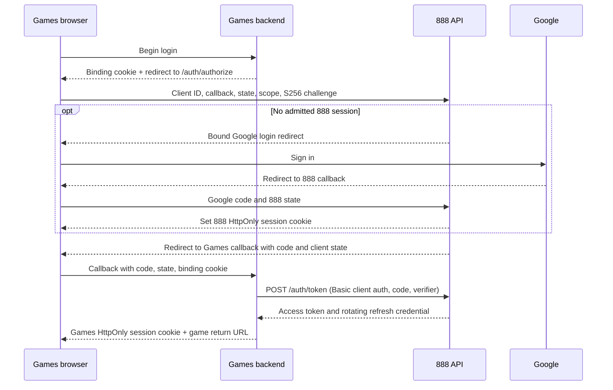

# Application authentication

888 provides direct browser sessions and delegated credentials for registered
first-party backends. Google always returns to the 888 API. The Games frontend
logs in through its own backend; the 888 frontend is not in that redirect path.

All API routes below are relative to `/api/v1`.

## Route and credential matrix

| Route | Caller and credentials | Result |
| --- | --- | --- |
| `GET /auth/login` | Browser navigation; registered cookie `client_id` | `303` to Google or the registered frontend |
| `GET /auth/authorize` | Browser navigation; registered backend client, state, S256 PKCE | `303` to Google or the registered backend callback |
| `GET /auth/callback` | Google redirect; one-use 888 state and matching browser binding cookie | Establish 888 session and resume the recorded application |
| `GET /auth/me` | 888 browser session cookie | `profile` and session-bound `csrf_token` |
| `POST /auth/logout` | 888 cookie, allowed Origin, CSRF for an active session | `204`, including missing/expired sessions |
| `POST /auth/token` | Confidential backend; HTTP Basic client authentication | Code exchange or rotating refresh credentials |
| `POST /auth/revoke` | Confidential backend; HTTP Basic client authentication | `200` plain-text `OK` |
| `GET /external/me` | Delegated Bearer access token; `profile.read` | `{ "profile": { ... } }` |
| `POST /external/deduct-coin` | Delegated Bearer access token; `coins.spend` | Atomic account deduction |

Cookie credentials do not authenticate external resources, code exchange, or
revocation. Delegated Bearer credentials do not authenticate browser APIs.
Swagger access credentials protect the documentation UI only.

## Configuration

Set `AUTH_CONFIG_FILE` to an operator-managed YAML file. The local registry is
[`config/auth.development.yaml`](../config/auth.development.yaml); use
[`config/auth.production.example.yaml`](../config/auth.production.example.yaml)
as a production template, replacing its example domains.

```yaml
version: 1

google:
  callback_uri: http://localhost:8080/api/v1/auth/callback

lifetimes:
  login_transaction_seconds: 600
  authorization_code_seconds: 60
  access_token_seconds: 3600
  delegation_idle_seconds: 604800
  delegation_absolute_seconds: 2592000

applications:
  - id: intania-888-web
    mode: cookie_session
    frontend_origin: http://localhost:3000
    default_return_path: /
    onboarding_path: /register/profile
    login_error_path: /login-error

  - id: intania-888-swagger
    mode: cookie_session
    frontend_origin: http://localhost:8080
    default_return_path: /swagger/index.html
    onboarding_path: /swagger/index.html
    login_error_path: /swagger/index.html

  - id: intania-games
    mode: authorization_code
    redirect_uris:
      - http://localhost:8081/auth/callback
    client_secret_env: INTANIA_GAMES_CLIENT_SECRET
    allowed_scopes:
      - profile.read
      - coins.spend
```

Set upstream `OAUTH_CLIENT_ID`, `OAUTH_CLIENT_SECRET`, and
`JWT_ACCESS_TOKEN_SECRET` through backend configuration. Provision the client
secret named by `client_secret_env` in the 888 process environment and the
consuming backend. It must contain at least 32 characters. Do not store the
secret in YAML or expose it to a frontend.

Startup validates the entire registry: version, unique application IDs, supported
modes and scopes, unique callbacks/scopes, destinations, secrets, and lifetimes.
Unknown YAML fields are rejected. Cookie applications cannot have delegated
settings, and delegated applications cannot have cookie destination settings.
Callback URLs match exactly, including path and query; production requires
HTTPS. A cookie application's exact `frontend_origin` must appear in
`CORS_ALLOW_ORIGINS`. The Swagger application's origin must match the API
origin in `SERVER_URL`; its Google callback still uses `google.callback_uri`.

The displayed lifetime values are local configuration, not fixed protocol
constants. Each must be positive. Delegation absolute lifetime must cover its
idle lifetime, and access lifetime must fit within the absolute lifetime. Access
responses may have a shorter `expires_in` near the delegation's absolute expiry.
888 browser session idle/absolute lifetimes use separate environment settings:
`SESSION_IDLE_TTL_SECONDS` and `SESSION_ABSOLUTE_TTL_SECONDS` (defaults: 7 and
30 days). Activity renews idle expiry, bounded by absolute expiry.

The registry is loaded at startup; restart 888 after changing registrations,
secrets, callback URLs, or lifetimes. Removing a client or required scope also
makes credentials fail their current-registration checks.

## Cloud Run deployment

The deployment workflow requires the GitHub Actions secret `AUTH_REGISTRY_YAML`
to contain the complete production registry. Start from the production example,
replace every destination with its deployed HTTPS URL, and ensure each cookie
application's frontend origin appears in the deployment's `CORS_ALLOW_ORIGINS`.
The Google callback must match the authorized redirect URI configured in Google.
Only register backend applications that are ready to deploy.

Before building the image, the workflow writes that registry to
`config/auth.production.yaml`. The Docker runtime copies `config` to `/config`,
and Cloud Run receives `AUTH_CONFIG_FILE=/config/auth.production.yaml`. A missing
registry secret fails the workflow before the image build instead of producing a
revision that cannot start. Registry contents must contain secret **references**,
not client secret values.

For the `intania-games` registration, provision the GitHub Actions secret
`INTANIA_GAMES_CLIENT_SECRET`; the workflow passes it to the 888 runtime, and the
same value must be configured on the Games backend. If a registry references
other client-secret environment variables, add those variables to the deployment
as well. Local registries and example domains are not production fallbacks.
The older `OAUTH_REDIRECT_URI` and `OAUTH_POST_LOGIN_REDIRECT_URL` deployment
variables do not configure the registry's Google callback or application paths.

## Direct browser login

Navigate to:

```text
http://localhost:8080/api/v1/auth/login?client_id=intania-888-web&return_to=%2F
```

Use browser navigation, not a JSON fetch of a Google login URL. `client_id` must
identify a `cookie_session` application. Optional `return_to` defaults to that
application's `default_return_path`; it must be a relative path beginning with
one `/` on the registered origin. Absolute URLs, `//` authorities, backslashes,
fragments, and control characters are rejected, including encoded forms.
`redirect_to` is unsupported. A query string is allowed in a safe return path.

888 reuses an existing admitted session when possible. Otherwise it stores a
one-use Google state and PKCE verifier in Redis, binds the login to a separate
HttpOnly transaction cookie, and redirects to Google. The callback checks and
consumes the state and cookie binding, verifies Google identity and account
policy, creates the 888 session, and resumes the recorded application. New users
are sent to `onboarding_path` with the validated original path in `return_to`.
After saving a profile, the frontend validates that path before navigating to it.

Cookie failures redirect to the registered `login_error_path` with `error`.
Invalid or untrusted client/destination requests render a local error page.
Use a consistent hostname for browser login and callback: `localhost` and
`127.0.0.1` have different host-only cookies.

Development uses `session` and independent `oauth-tx-<state>` cookies.
Production uses `__Host-session` and `__Host-oauth-tx-<state>` with `Secure`,
`HttpOnly`, `Path=/`, `SameSite=Lax`, and no `Domain`. Independent transaction
cookies support concurrent login attempts, subject to the pending-attempt limit.

Protected browser requests send credentials. Hold the `/auth/me` `csrf_token`
in memory and send it as `X-CSRF-Token` for active-session mutations. The browser
supplies Origin; configure the exact frontend origin. Browser routes have no
refresh-token endpoint and return no credentials for JavaScript storage.

## Backend delegation



1. The game backend generates random state, a PKCE verifier, and a browser
   binding. It stores the intended game return path locally, separate from the
   registered OAuth callback.
2. Navigate to `/auth/authorize` with `client_id`, exact `redirect_uri`,
   `response_type=code`, nonempty `state` (at most 512 bytes), a nonempty
   space-separated `scope`, `code_challenge`, and `code_challenge_method=S256`.
   Requested scopes must be supported, allowed by the registration, and unique.
3. 888 reuses its admitted browser session or runs Google login. The browser
   returns to the registered game backend callback with a short-lived, one-use
   `code` and the original client `state`. Validated failures return `error` and
   `state` to that callback. A game may receive an account with `group_id=null`;
   it must enforce its own onboarding/playable-group requirements.
4. The game backend verifies and consumes its browser-bound state. It sends
   form-encoded `POST /auth/token` with HTTP Basic client authentication:

   ```text
   grant_type=authorization_code
   code=<one-use-code>
   redirect_uri=http://localhost:8081/auth/callback
   code_verifier=<original-verifier>
   ```

   The code binds the account, client, callback, scopes, and S256 challenge.
   The verifier uses 43–128 permitted PKCE characters. Wrong bindings, expiry,
   or replay produce `invalid_grant`.
5. 888 returns:

   ```json
   {
     "access_token": "<delegated-jwt>",
     "refresh_token": "<opaque-refresh-credential>",
     "token_type": "Bearer",
     "expires_in": 3600,
     "scope": "profile.read coins.spend",
     "user_id": "<888-account-id>"
   }
   ```

   `expires_in` is the issued access lifetime, not a hardcoded client refresh
   interval. The game stores credentials server-side and issues its own opaque
   HttpOnly session cookie. Tokens and client secrets never go in frontend URLs
   or browser storage.
6. Refresh uses the same client authentication and form body:

   ```text
   grant_type=refresh_token
   refresh_token=<current-refresh-credential>
   ```

   Refresh rotates the credential and preserves the grant's absolute expiry.
   Persist the new pair atomically and serialize refreshes per delegation.
   Reusing a consumed refresh credential revokes the entire delegation.
7. Game logout posts a form-encoded `token` to `/auth/revoke` with client
   authentication. It accepts an opaque refresh credential or valid delegated
   access token owned by that client. Unknown, expired, already-revoked, and
   other-client credentials also return `200 OK` without revealing ownership.
   Revocation does not revoke the independent 888 browser session. 888 logout
   likewise does not log out the game delegation.

HTTP Basic uses `client_secret_basic`: form-url-encode the client ID and secret
individually, join with `:`, then Base64 encode. Send the result as
`Authorization: Basic <encoded-value>`. Do not use browser cookies or CSRF for
these exchanges.

## Scopes and external resources

`allowed_scopes` is a maximum permission set, not an automatic grant. The
requested authorization scopes become grant and access-token scopes. Each
resource checks its permission against the current client registration, active
grant, and access token. Route registration declares the required scope using
`RequireExternalScope`; adding a route does not require a path/method switch in
authentication middleware.

| Scope | Resource | Payload |
| --- | --- | --- |
| `profile.read` | `GET /external/me` | `profile` without CSRF |
| `coins.spend` | `POST /external/deduct-coin` | JSON `{ "amount": "25.00" }` |

The account comes from authentication. Deduction accepts no caller user ID and
returns `success`, `deducted_amount`, and `remaining_balance`, with two-decimal
money strings. Numeric amounts and unknown JSON fields are rejected.

External resources skip the browser Origin guard and CSRF, but CORS still
controls browser access. Backend-to-backend calls need no CORS origin. The Games
frontend uses its game backend cookie, so its origin belongs in the Games
backend CORS configuration; its backend callback belongs in the 888 registry.

## Responses and errors

Every response includes `X-Request-ID`. Resource failures use
`{ "code", "message", "request_id", "details?" }`. Authentication protocol
responses have these exceptions:

| Route or failure | Response |
| --- | --- |
| Successful login/authorization/callback | `303`, destination in `Location` |
| Validated application failure | `303`, registered destination with `error`; backend callback also receives `state` |
| Invalid/untrusted browser transaction | Local HTML error, typically `400`; pending login cap uses `429` |
| Invalid backend client authentication | `401`, `{ "error": "invalid_client" }`, Basic `WWW-Authenticate` challenge |
| Malformed form request | `400`, `{ "error": "invalid_request" }` |
| Unsupported grant type | `400`, `{ "error": "unsupported_grant_type" }` |
| Invalid, expired, reused, or policy-denied grant | `400`, `{ "error": "invalid_grant" }` |
| Token/revocation dependency failure | `503`, `{ "error": "temporarily_unavailable" }` |
| Missing/invalid external credentials or denied account | `401 UNAUTHORIZED`, resource envelope |
| Missing required external scope | `403 FORBIDDEN`, resource envelope |
| Insufficient coins | `422 INSUFFICIENT_BALANCE`, resource envelope |
| API-wide per-IP rate limit | `429 TOO_MANY_REQUESTS`, resource envelope, including on protocol routes |

Login/authorization/callback/token/revocation disable caching. Restart a failed
browser flow rather than reusing a consumed callback transaction. Treat a
resource dependency failure as unconfirmed and retain diagnostics for retry or
reconciliation as appropriate.

## Deployment checklist

- Configure Google credentials and the exact 888 `google.callback_uri` in Google.
- Register each frontend/backend and provision matching backend client secrets.
- Configure exact browser origins and production HTTPS destinations.
- Deploy the game's transaction/session storage and callback before changing login.
- Replace JSON login fetching with navigation; remove browser token storage.
- Check browser redirects and container-to-host connectivity separately. A `303`
  from `/auth/authorize` does not verify server-to-server code exchange.
- On the local ports, 888 FE uses `3000`, API uses `8080`, Games FE uses `3001`,
  and Games backend callback uses `8081`. The Games Compose internal URL may use
  `host.docker.internal` while the public browser URL uses `localhost`.

Authentication does not resolve cross-database spending consistency. The game
and 888 cannot share a database transaction; 888 provides no reservation,
idempotency key, refund, result submission, or winnings-credit endpoint in this
contract. Complete that recovery design before enabling paid game actions.

## Authentication request budgets

Login and authorization initiation share an IP budget; callbacks have an
independent budget. Token exchange and revocation each have a separate verified
application budget. Invalid Basic credentials share a smaller IP failure budget,
which valid credentials bypass. Rate rejections use `429 TOO_MANY_REQUESTS` and
the resource API envelope with `Retry-After`. The five-pending-login guard still
applies. See [rate limiting](rate-limiting.md) for defaults, burst behavior,
configuration, and the Cloud Run rollout checks.
